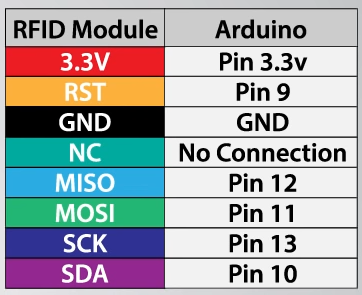
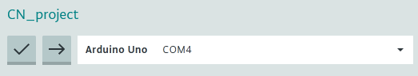

# RFID Encryption Project
### Authors: Baldy, Nicole and Falcione, Elena

This project implements a basic system where information is encrypted and written to a passive RFID tag using an Arduino Uno. The encryption method used is a very simple implementation of AES, or Advanced Encryption Standard; the RFID writing uses the MFRC522 chip and library with an Arduino. 

:warning: The encryption code on the laptop side is meant to be a simple example of **how AES works** - this is **not safe** to implement in a system as-is, due to vulnerability to timing attacks, key attacks, and potential errors in implementation. 

TODO: Add pin layout, a basic description of code and libraries needed, and how to run. Also add code documentation (need to update comments) if time permits.

### To Run:
#####  Set up the Arduino:
* As the [MFRC522 library](https://github.com/miguelbalboa/rfid) suggests, setup the arduino according to the following wiring diagram (From [this youtube Tutorial](https://www.youtube.com/watch?v=QSx778Gr6Y4))

* Using the [Arduino IDE](https://www.arduino.cc/en/software), upload the [the Arduino Sketch](arduino_src\RFID_ReadWrite.ino) to the board. It should run and open a serial port automatically.
    * Using the COM Port in which the IDE detects the arduino (below: COM4 is detected for our setup), edit [the server python code](server_src\RFID_Server.py) to set `COM_PORT` to the appropriate value.

##### Run the python server-side
* After downloading the server code and setting up the arduino, run the server-side code: `python3 <path_to_code>/RFID_Server.py`
    * The arduino must be powered on and running the correct code for this to work properly.
* Follow the code instructions - enter `R` to read the current state of the RFID card, or `W` to write a new message.
    * The written message will be encoded before being sent to the arduino.
    * The read message is assumed to have been encoded and will be decoded.

### Learn more

##### AES
* [Computerphile has a very easily-understood overview of how AES works](https://www.youtube.com/watch?v=O4xNJsjtN6E)
* [AES Step-by-Step Encryption examples](https://kavaliro.com/wp-content/uploads/2014/03/AES.pdf)
* [Detailed explamation of the MixColumns step](http://www.herongyang.com/Cryptography/AES-MixColumns-Procedure-Algorithm.html)
* [Detailed explanation of the Key Schedule algorithm](https://braincoke.fr/blog/2020/08/the-aes-key-schedule-explained/#aes-in-summary)
* [Simple AES Animation](https://www.youtube.com/watch?v=gP4PqVGudtg)

##### RFID
* [MFRC522 Datasheet](https://www.mouser.com/datasheet/2/302/MF1S503x-89574.pdf)
* [Arduino MFRC522 library](https://www.arduino.cc/reference/en/libraries/mfrc522/)
* [Uses MIFARE Protocol](https://en.wikipedia.org/wiki/MIFARE)
* [A short video on how RFID wors](https://en.wikipedia.org/wiki/MIFARE)